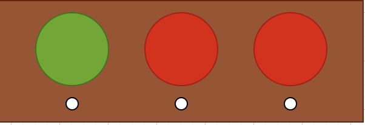

# Staging Interaction

**Kyle Li**
**Leen Huang**
**Alex Gravereaux**
**Angela Bi**

In the original stage production of Peter Pan, Tinker Bell was represented by a darting light created by a small handheld mirror off-stage, reflecting a little circle of light from a powerful lamp. Tinkerbell communicates her presence through this light to the other characters. See more info [here](https://en.wikipedia.org/wiki/Tinker_Bell).

There is no actor that plays Tinkerbell--her existence in the play comes from the interactions that the other characters have with her.

For lab this week, we draw on this and other inspirations from theatre to stage interactions with a device where the main mode of display/output for the interactive device you are designing is lighting. You will plot the interaction with a storyboard, and use your computer and a smartphone to experiment with what the interactions will look and feel like.

_Make sure you read all the instructions and understand the whole of the laboratory activity before starting!_

## Lab Overview
For this assignment, you are going to:

A) [Plan](#part-a-plan)

B) [Act out the interaction](#part-b-act-out-the-interaction)

C) [Prototype the device](#part-c-prototype-the-device)

D) [Wizard the device](#part-d-wizard-the-device)

E) [Costume the device](#part-e-costume-the-device)

F) [Record the interaction](#part-f-record)

Labs are due on Mondays. Make sure this page is linked to on your main class hub page.

## Part A. Plan

This interaction will take place in a general household. I think a common problem that many people run into are being aware of the chores they need to complete. This device is able to be used at all points of the day, and is for whoever lives in the house. It would act as some sort of a visual indicator of chores needing to be completed. There would be a light system in the shape of a horizontal traffic light, with each light glowing red at first. When a chore is completed, users can press a button on the corresponding light which will turn the light green. Therefore, the goal is to finish all chores, therefore marking the lights as all green. When people pass by this device, the red lights will ideally remind them that there are chores that need to be completed.

[storyboards](https://www.canva.com/design/DAGxXWVKHNo/LAtmwmhQluG8MgYO0QPKLQ/view?utm_content=DAGxXWVKHNo&utm_campaign=designshare&utm_medium=link2&utm_source=uniquelinks&utlId=h15b7a45be6)

The main concern with this is conflicting opinions of what a "finished" chore is considered. Some roommates may feel that the dishes are not fully washed, so the light should not be green. The straightforward solution I came for this would be to limit this device for individual tasks, so there wouldn't be a debate as to whether a chore is complete. Alternatively the roommates could come to an agreement beforehand on what is considered a finished chore.

## Part B. Act out the Interaction

One main thing I noticed while acting this out relates to the resetting feature, since chores are a recurring event. There is no simple automatic way to determine when a green light should turn red again, and for some people they might see that the chores need to be redone, change the light to red, only to do the chore and immediately change it back to green. This can make it a little redundant since there isn't really necessarily a reminder anymore. The "complicated" solution would be adding an automated detection system for when certain chores need to be done (weight sensor for trash/laundry, camera for dishes, etc.)

## Part C. Prototype the device

I had no issues with using Tinkerbelle (aside from the already known bug of the tinkerbell option not working for iPhones)!

## Part D. Wizard the device
Take a little time to set up the wizarding set-up that allows for someone to remotely control the device while someone acts with it. Hint: You can use Zoom to record videos, and you can pin someone’s video feed if that is the scene which you want to record.

\*\***Include your first attempts at recording the set-up video here.**\*\*
https://github.com/user-attachments/assets/d5b454ee-eb61-42e7-9879-bfe9019b52ec

Now, hange the goal within the same setting, and update the interaction with the paper prototype.

\*\***Show the follow-up work here.**\*\*

https://github.com/user-attachments/assets/37041e08-9c7c-493a-bfe6-323bde343240

## Part E. Costume the device

Only now should you start worrying about what the device should look like. Develop three costumes so that you can use your phone as this device.

Think about the setting of the device: is the environment a place where the device could overheat? Is water a danger? Does it need to have bright colors in an emergency setting?

\*\***Include sketches of what your devices might look like here.**\*\*

The structure of the device should be pretty simple, since it should just act as an alert light. The container can be a simple box to hold the light, with a spot to have a button to set a goal as completed.

## Part F. Record

\*\***Take a video of your prototyped interaction.**\*\*

\*\***Please indicate who you collaborated with on this Lab.**\*\*
Be generous in acknowledging their contributions! And also recognizing any other influences (e.g. from YouTube, Github, Twitter) that informed your design.

# Staging Interaction, Part 2

This describes the second week's work for this lab activity.

## Prep (to be done before Lab on Wednesday)

You will be assigned three partners from other groups. Go to their github pages, view their videos, and provide them with reactions, suggestions & feedback: explain to them what you saw happening in their video. Guess the scene and the goals of the character. Ask them about anything that wasn’t clear.

\*\***Summarize feedback from your partners here.**\*\*

## Make it your own

Do last week’s assignment again, but this time:
1) It doesn’t have to (just) use light,
2) You can use any modality (e.g., vibration, sound) to prototype the behaviors! Again, be creative! Feel free to fork and modify the tinkerbell code!
3) We will be grading with an emphasis on creativity.

\*\***Document everything here. (Particularly, we would like to see the storyboard and video, although photos of the prototype are also great.)**\*\*
