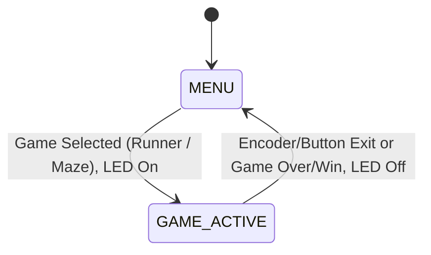

<<<<<<< HEAD
# Ph-UI!!!

**Collaborators:**  
Jesse Iriah
Angela Bi
=======

# Ph-UI!!!

<details>
	<summary><strong>Instructions for Students (Click to Expand)</strong></summary>
  
	**Submission Cleanup Reminder:**
	- This README.md contains extra instructional text for guidance.
	- Before submitting, remove all instructional text and example prompts from this file.
	- You may delete these sections or use the toggle/hide feature in VS Code to collapse them for a cleaner look.
	- Your final submission should be neat, focused on your own work, and easy to read for grading.
  
	This helps ensure your README.md is clear, professional, and uniquely yours!
</details>

---

## Lab 4 Deliverables

### Part 1 (Week 1)
**Submit the following for Part 1:**  
*️⃣ **A. Capacitive Sensing**
	- Photos/videos of your Twizzler (or other object) capacitive sensor setup
	- Code and terminal output showing touch detection

*️⃣ **B. More Sensors**
	- Photos/videos of each sensor tested (light/proximity, rotary encoder, joystick, distance sensor)
	- Code and terminal output for each sensor

*️⃣ **C. Physical Sensing Design**
	- 5 sketches of different ways to use your chosen sensor
	- Written reflection: questions raised, what to prototype
	- Pick one design to prototype and explain why

*️⃣ **D. Display & Housing**
	- 5 sketches for display/button/knob positioning
	- Written reflection: questions raised, what to prototype
	- Pick one display design to integrate
	- Rationale for design
	- Photos/videos of your cardboard prototype

---

### Part 2 (Week 2)
**Submit the following for Part 2:**  
*️⃣ **E. Multi-Device Demo**
	- Code and video for your multi-input multi-output demo (e.g., chaining Qwiic buttons, servo, GPIO expander, etc.)
	- Reflection on interaction effects and chaining

*️⃣ **F. Final Documentation**
	- Photos/videos of your final prototype
	- Written summary: what it looks like, works like, acts like
	- Reflection on what you learned and next steps
>>>>>>> a3e5122 (Add Lab 4)

---

## Lab Overview
<<<<<<< HEAD

This project explores physical user interfaces on the Raspberry Pi, focusing on sensor integration and prototyping new device forms. The goal is to use capacitive, light/proximity, gesture, rotary encoder, joystick, and distance sensors—then design the physical interaction and display for a new device.

---

## Part 1
### A. Capacitive Sensing

- **Setup:** Connected capacitive sensor to Pi using conductive materials from kit.
- **Test Video:**  
  [Capacitive Sensor Test](https://drive.google.com/drive/folders/1k5EjLj52QXkYCU0cCGVUmvABz0LI8WAS)  
  *This video shows the sensor hardware, Pi, and terminal output as clips are touched.*
- **Code:**  
  [cap_test.py](https://github.com/ji227/Jesse-Iriah-s-Lab-Hub/blob/Fall2025/Lab%204/cap_test.py)
- **Terminal Output:**  
  - Touching black alligator clip:  
    `Twizzler 0 touched!`
  - Touching white alligator clip:  
    `Twizzler 1 touched!`
  
---

### B. More Sensors

#### 1. Light/Proximity/Gesture Sensor (Adafruit APDS-9960)
- **Videos:**  
  - [Light Test](https://drive.google.com/file/d/1ynyXdRq7TfnPcbY4HaUFE6u_20OG_65H/view?usp=sharing)
  - [Proximity Test](https://drive.google.com/file/d/1AJwVIZ33KkiBfIbnyfk7PMNJ0pQdXZVZ/view?usp=sharing)
  - [Gesture Test](https://drive.google.com/file/d/1MKmHFrpkHARHvOo0EEXghPhEa9gxnTVY/view?usp=sharing)
- **Code:**  
  - [color_test.py](https://github.com/IRL-CT/Interactive-Lab-Hub/blob/Fall2025/Lab%204/color_test.py)
  - [proximity_test.py](https://github.com/IRL-CT/Interactive-Lab-Hub/blob/Fall2025/Lab%204/proximity_test.py)
  - [gesture_test.py](https://github.com/ji227/Jesse-Iriah-s-Lab-Hub/blob/Fall2025/Lab%204/gesture_test.py)
- **Terminal Output:**  
  - Color sensor output (~0.5s updates):
    ```
    red:  145
    green:  223
    blue:  124
    clear:  300
    color temp 5600
    light lux 290
    ```
  - Proximity sensor output (~0.2s updates):
    ```
    38
    40
    39
    ```
  - Gesture sensor output on detected gestures:
    ```
    up
    down
    left
    right
    ```

#### 2. Rotary Encoder
- **Video:**  
  [Rotary Encoder Test](https://drive.google.com/drive/folders/1k5EjLj52QXkYCU0cCGVUmvABz0LI8WAS)
- **Code:**  
  [encoder_test.py](https://github.com/ji227/Jesse-Iriah-s-Lab-Hub/blob/Fall2025/Lab%204/encoder_test.py)
- **Terminal Output:**
  	```
  	Found product 4991
	Position: 0
	Position: 1
	Position: 2
	Button pressed
	Button released
  	```

#### 3. Joystick
- **Video:**  
  [Joystick Test](https://drive.google.com/file/d/12tLrw4grtVd-AorB-V6PifySKMY9VJEA/view?usp=sharing)
- **Code:**  
  [joystick_test.py](https://github.com/IRL-CT/Interactive-Lab-Hub/blob/Fall2025/Lab%204/joystick_test.py)
- **Terminal Output:**  
	```
  	X: 507, Y: 524, Button: 1
	X: 750, Y: 300, Button: 1
	X: 512, Y: 512, Button: 0
 	```

#### 4. Distance Sensor
- **Video:**  
  [Distance Sensor Test](https://drive.google.com/file/d/1x9kApo4Re5UTOoBUEivQTzrcoP8KNI6Q/view?usp=sharing)
- **Code:**  
  [qwiic_distance.py](https://github.com/IRL-CT/Interactive-Lab-Hub/blob/Fall2025/Lab%204/qwiic_distance.py)
- **Terminal Output:**  
	```
  	SparkFun Proximity Sensor VCN4040 Example 1
	Proximity Value: 38
	Proximity Value: 40
	Proximity Value: 39
 	```

---

### C. Physical Sensing Design

- **Sketches:**  
	

- **Reflection - What are some things these sketches raise as questions? What do you need to physically prototype to understand how to anwer those questions?**  
  The five sketches explore different physical forms inspired by classic 90s retro gaming devices and handheld consoles, focusing on a simple, recognizable style suitable for a 2D platformer game. The designs reflect iconic shapes such as a Gameboy, PSP, arcade machine, laptop keyboard layout, and a video game controller, each incorporating buttons and dials positioned for intuitive jump/duck and volume control interactions. These different formats raise design questions related to ergonomics, button placement, user comfort, and control intuitiveness. For example, the portability of the Gameboy contrasts with the immersive feel of an arcade machine setup. The sketches also highlight challenges in balancing screen visibility, control accessibility, and housing size.
  
  Key questions for prototyping include how button size and spacing affect rapid jump/duck input, the dial placement’s ease of use for volume control, and how different device shapes accommodate sustained gameplay without fatigue.
  
  Physical prototypes are needed to test button spacing, size, and placement relative to hand reach and movement. Also, the dialing mechanism for volume control requires testing for tactile feedback and ease of adjustment.   

- **Prototype Selection:**    
  The Gameboy-inspired layout was selected for prototyping due to its compact size, ergonomic button placement, and familiarity, which promises a user-friendly interaction experience.  

---

### D. Display & Housing

- **Sketches:**  
  *Placeholder for 5 display/button/knob positioning sketches.*
  
  - *Content:* Five layout designs were created for the Gameboy-style device, varying the physical positions of the OLED display, jump and duck buttons, and the rotary volume dial:

- **Reflection:**  
  *Short explanation about questions raised during sketching, and what needs to be prototyped to answer those questions.*
  These sketches raised design questions including:  
  - How does the positioning of buttons affect reachability and prevent accidental presses?
  - What button sizes best balance quick access and comfort?
  - Where should the rotary dial be placed for intuitive volume control without interfering with gameplay?
  - How visible is the display from natural holding angles during active use?
  - Does the form factor allow comfortable grip and sustained interaction without fatigue?  
  
  Physical cardboard prototypes are needed to test the ergonomics of button and dial placement, the comfort of the grip while holding the device, and display visibility at typical viewing angles. Prototyping will help answer tactile feedback and spacing challenges that sketches alone cannot resolve.  

- **Integrated Design Selection:**  
  *Note which display/housing design will be used in your prototype and the rationale for selection (e.g. size, simple interface, visibility).*  
  The Gameboy-inspired layout was initially selected for prototyping due to its compact size, ergonomic button placement, and familiarity.  The first layout—centered display with symmetrical buttons below and rotary dial on the top edge—was chosen. This design balances symmetry for easy ambidextrous use and places controls where thumbs naturally rest while holding the device. The size and positioning ensure the screen is clearly visible during play.  

- **Final Prototype:**  
  *Include photos or video documenting your prototype. Paste link, image, or video embed here.*
  The final design incorporates a **Waveshare 2.23-inch OLED Hat** and replaces the capacitive buttons with the **Rotary Encoder** and **Joystick** for a robust, dedicated control interface.
  - Component update & connectivity: The final configuration utilizes the **Waveshare 2.23-inch OLED Hat** (wide screen), which mounts directly onto the Raspberry Pi's **40 GPIO pins**. An **I2C SHIM** is physically sandwiched between the display and the Pi to provide accessible I2C connections for the external **Rotary Encoder** and **Joystick**. All three components (Display, Encoder, Joystick) communicate using the I2C protocol.
  - Component measurements (approximate):  
	  
      
      

  - Cardboard prototype:
  	- Description: *The cardboard prototype represents the physical realization of the Gameboy-inspired design, allowing for ergonomic validation of the selected components. The final arrangement features the Waveshare 2.23-inch OLED Hat display centered at the top, mounted directly to the Raspberry Pi. The key interactive components, the Rotary Encoder (bottom-left) and the Joystick (bottom-right), are symmetrically placed for intuitive two-handed control, replacing the initial capacitive button concept. To manage the hardware connections, an I2C SHIM is sandwiched between the display and the Pi, providing I2C access for the external controls. This layout and construction allow for testing the grip comfort and the placement of controls relative to the user's natural hand position during play, effectively transitioning from the sketched concept to a physical model for validation.*   
 		


## Part 2
### E. Multi-Device Demo
The multi-device prototype implements a handheld, retro-inspired game console prototype featuring two input devices and two output devices integrated via Raspberry Pi. Inputs include a **Qwiic Joystick** for directional control and button presses, and a **Rotary Encoder** for menu navigation and selection. Outputs consist of a **Waveshare 2.23" OLED Display HAT** delivering real-time monochrome visual feedback, and a **Qwiic Button** with an integrated green LED that acts as a state indicator during gameplay and turning off in menus.

The design draws inspiration from classic 90s handheld gaming consoles, emphasizing functional placement for intuitive, comfortable control during play. It supports two geometry-themed games—a DINO-inspired runner and a Maze puzzle—each utilizing different control schemes while providing visually distinct feedback through the OLED screen and LED indicator. The overall system demonstrates a playful yet functional approach to chaining physical interfaces and outputs in a compact form factor.

- **Demo Code & Video:**  
  - *Code:* [geometry_game.py](https://github.com/ji227/Jesse-Iriah-s-Lab-Hub/blob/Fall2025/Lab%204/Deliverables/geometry_game.py)
    (assisted code generation from Gemini)
  - *Videos:*
 	 - Game 1 (Geometry Runner) Demo: https://drive.google.com/drive/folders/1k5EjLj52QXkYCU0cCGVUmvABz0LI8WAS
 	 - Game 2 (Maze) Demo: https://drive.google.com/drive/folders/1k5EjLj52QXkYCU0cCGVUmvABz0LI8WAS

- **Interaction Diagram/Sketch:**
- Comments: *The diagram below shows the fixed physical arrangement of components: The **OLED Display** is centered at the top. The **Raspberry Pi** is placed upside down to route the USB-C power cable out the top-right corner. The rotary encoder is on the bottom-left, and the joystick is on the bottom-right. The I2C SHIM's role as the connection point is highlighted.*
 		

- **State Machine Diagram:**
- Comments: *The state machine diagram below illustrates the device's entire user flow, detailing transitions between the Menu and the two game states.*


  
- **Reflection:**  
  *Multi-input/Multi-Output Chaining Reflection*  
	- System Integration and Interface Chaining: Integrating multiple I2C/Qwiic and SPI devices (Joystick, Rotary Encoder, OLED display, Qwiic Button LED) significantly increased system interactivity beyond single-component operation. The compact handheld form factor was achieved by using an I2C SHIM to access the bus while the display HAT occupied the main GPIO header, demonstrating a practical solution for pin conflicts.
	- New Types of Interaction (Multi-Input/Multi-Output): Combining the two inputs allows for multi-modal interaction where roles can be assigned by context. For instance, the Rotary Encoder is mapped to discrete menu selection, leveraging its precision and detents, while the Joystick is reserved for continuous positional or velocity control within a game. The Qwiic Button LED provides a new, non-visual feedback channel that augments the OLED display by providing unambiguous state indication ("active gameplay").
	- Device Role and Arrangement Effects:
		- Physical Arrangement: The symmetrical placement of the Rotary Encoder and Joystick on the cardboard chassis was validated for improved grip comfort and two-handed control. The "upside-down Pi" setup was a functional arrangement decision made specifically to manage power cable routing and maintain primary interaction space.
		- Swapping Primary/Secondary: Observing the system behavior highlighted that the Joystick naturally serves as the primary input for directional game control, while the Encoder's push-button function is highly effective as a dedicated secondary input (e.g., a rapid "back to menu" command), confirming component suitability for specific tasks.
	- Challenges and Constraints: The primary challenge was the strict 128x32 display resolution, which severely constrained the visual complexity of both the Geometry Runner and Maze Game. Furthermore, verifying input and output response times across the chained I2C and SPI buses required careful testing to ensure fluid gameplay.

- **Feedback:**
The prototype was demonstrated to Angela and Iqra, who offered feedback on potential enhancements and future directions. Both noted that adding sound output or haptic feedback could further highlight key gameplay moments, such as successful movements or collisions. The system could be expanded to include multiple lights or colors for distinguishing between different games or states, enhancing visual feedback. A suggestion was made to integrate player customization options, such as selecting sprite shapes or LED colors, to increase engagement. Overall, the handheld form factor and control layout were considered intuitive, but further sensory feedback modes and personalization features would create a richer user experience.
  
---

### F. Final Documentation

**Looks Like (Aesthetics and Form Factor)**
The final prototype adopts a simple, two-handed handheld console form factor, adhering to the Gameboy-inspired sketches. The chassis uses rigid cardboard and masking tape to achieve a fixed, compact enclosure suitable for ergonomic testing. The Waveshare 2.23-inch OLED Display HAT is centrally positioned at the top for optimal screen visibility. The Rotary Encoder and Qwiic Joystick are mounted symmetrically below the display—Encoder on the left, Joystick on the right—to accommodate two-handed control. The separate Qwiic Button LED module is visible at the top edge and acts as the system status indicator. The Raspberry Pi is internally oriented to route the power supply cable away from the grip area, confirming the physical design decisions made during the iteration process.

**Works Like (Functionality and Technical Implementation)**
The system operates as a multi-input/multi-output demonstrator. It utilizes the Joystick for analog directional input and a selection button, and the Rotary Encoder for discrete value changes (menu item selection) and a secondary 'back' button press. The outputs include the 128x32 pixel monochrome display for all visual game feedback and menu rendering, and the integrated Qwiic Button LED for system state indication. The software implements a centralized state machine that controls the active game loop, manages all component inputs, and modulates the Qwiic LED output. The integration of the I2C SHIM successfully facilitated the simultaneous use of the display, Encoder, and Joystick.

**Acts Like (Interaction and User Flow)**
User interaction begins at the MENU state, where the Qwiic LED is OFF. The user rotates the Encoder or uses the Joystick's vertical axis to cycle between the Geometry Runner and Maze Game options. Pressing the Encoder's push-button or the Joystick's integrated button selects the game and initiates the transition. Upon entering a game state, the Qwiic LED turns ON, providing immediate visual confirmation that gameplay is active. Within a game, the Joystick provides the primary input (e.g., jump/duck in Runner, movement in Maze). To exit any game and return to the MENU, the user presses the Encoder's push-button, and the LED instantly switches OFF, confirming the system state change. This flow demonstrates clear, multi-modal feedback essential for an interactive physical device.

I worked with Jesse Iriah to create the code and prototype for this assignment, and Angela Bi helped by contributing her thoughts and critiques.


**DEMO Snippets**


https://github.com/user-attachments/assets/4ce5b002-b887-4d37-bc54-04713a90b154


https://github.com/user-attachments/assets/232e628e-fd51-44e7-aedc-f7ceede9e64b


---

## Additional Notes


The final prototype required the use of the Waveshare 2.23-inch OLED Hat as the main display, as it was a component sourced outside of the provided kit. Documentation for this specific component can be found here: https://www.waveshare.com/wiki/2.23inch_OLED_HAT

---

=======
**NAMES OF COLLABORATORS HERE**


For lab this week, we focus both on sensing, to bring in new modes of input into your devices, as well as prototyping the physical look and feel of the device. You will think about the physical form the device needs to perform the sensing as well as present the display or feedback about what was sensed. 

## Part 1 Lab Preparation

### Get the latest content:
As always, pull updates from the class Interactive-Lab-Hub to both your Pi and your own GitHub repo. As we discussed in the class, there are 2 ways you can do so:


Option 1: On the Pi, `cd` to your `Interactive-Lab-Hub`, pull the updates from upstream (class lab-hub) and push the updates back to your own GitHub repo. You will need the personal access token for this.
```
pi@ixe00:~$ cd Interactive-Lab-Hub
pi@ixe00:~/Interactive-Lab-Hub $ git pull upstream Fall2025
pi@ixe00:~/Interactive-Lab-Hub $ git add .
pi@ixe00:~/Interactive-Lab-Hub $ git commit -m "get lab4 content"
pi@ixe00:~/Interactive-Lab-Hub $ git push
```

Option 2: On your own GitHub repo, [create pull request](https://github.com/FAR-Lab/Developing-and-Designing-Interactive-Devices/blob/2021Fall/readings/Submitting%20Labs.md) to get updates from the class Interactive-Lab-Hub. After you have latest updates online, go on your Pi, `cd` to your `Interactive-Lab-Hub` and use `git pull` to get updates from your own GitHub repo.

Option 3: (preferred) use the Github.com interface to update the changes.

### Start brainstorming ideas by reading: 

* [What do prototypes prototype?](https://www.semanticscholar.org/paper/What-do-Prototypes-Prototype-Houde-Hill/30bc6125fab9d9b2d5854223aeea7900a218f149)
* [Paper prototyping](https://www.uxpin.com/studio/blog/paper-prototyping-the-practical-beginners-guide/) is used by UX designers to quickly develop interface ideas and run them by people before any programming occurs. 
* [Cardboard prototypes](https://www.youtube.com/watch?v=k_9Q-KDSb9o) help interactive product designers to work through additional issues, like how big something should be, how it could be carried, where it would sit. 
* [Tips to Cut, Fold, Mold and Papier-Mache Cardboard](https://makezine.com/2016/04/21/working-with-cardboard-tips-cut-fold-mold-papier-mache/) from Make Magazine.
* [Surprisingly complicated forms](https://www.pinterest.com/pin/50032245843343100/) can be built with paper, cardstock or cardboard.  The most advanced and challenging prototypes to prototype with paper are [cardboard mechanisms](https://www.pinterest.com/helgangchin/paper-mechanisms/) which move and change. 
* [Dyson Vacuum Cardboard Prototypes](http://media.dyson.com/downloads/JDF/JDF_Prim_poster05.pdf)
<p align="center"> </p>

### Gathering materials for this lab:

* Cardboard (start collecting those shipping boxes!)
* Found objects and materials--like bananas and twigs.
* Cutting board
* Cutting tools
* Markers


(We do offer shared cutting board, cutting tools, and markers on the class cart during the lab, so do not worry if you don't have them!)

## Deliverables \& Submission for Lab 4

The deliverables for this lab are, writings, sketches, photos, and videos that show what your prototype:
* "Looks like": shows how the device should look, feel, sit, weigh, etc.
* "Works like": shows what the device can do.
* "Acts like": shows how a person would interact with the device.

For submission, the readme.md page for this lab should be edited to include the work you have done:
* Upload any materials that explain what you did, into your lab 4 repository, and link them in your lab 4 readme.md.
* Link your Lab 4 readme.md in your main Interactive-Lab-Hub readme.md. 
* Labs are due on Mondays, make sure to submit your Lab 4 readme.md to Canvas.


## Lab Overview

A) [Capacitive Sensing](#part-a)

B) [OLED screen](#part-b) 

C) [Paper Display](#part-c)

D) [Materiality](#part-d)

E) [Servo Control](#part-e)

F) [Record the interaction](#part-f)


## The Report (Part 1: A-D, Part 2: E-F)

### Quick Start: Python Environment Setup

1. **Create and activate a virtual environment in Lab 4:**
	```bash
	cd ~/Interactive-Lab-Hub/Lab\ 4
	python3 -m venv .venv
	source .venv/bin/activate
	```
2. **Install all Lab 4 requirements:**
	```bash
	pip install -r requirements2025.txt
	```
3. **Check CircuitPython Blinka installation:**
	```bash
	python blinkatest.py
	```
	If you see "Hello blinka!", your setup is correct. If not, follow the troubleshooting steps in the file or ask for help.

### Part A
### Capacitive Sensing, a.k.a. Human-Twizzler Interaction 

We want to introduce you to the [capacitive sensor](https://learn.adafruit.com/adafruit-mpr121-gator) in your kit. It's one of the most flexible input devices we are able to provide. At boot, it measures the capacitance on each of the 12 contacts. Whenever that capacitance changes, it considers it a user touch. You can attach any conductive material. In your kit, you have copper tape that will work well, but don't limit yourself! In the example below, we use Twizzlers--you should pick your own objects.


<p float="left">

 
</p>

Plug in the capacitive sensor board with the QWIIC connector. Connect your Twizzlers with either the copper tape or the alligator clips (the clips work better). Install the latest requirements from your working virtual environment:

These Twizzlers are connected to pads 6 and 10. When you run the code and touch a Twizzler, the terminal will print out the following

```
(circuitpython) pi@ixe00:~/Interactive-Lab-Hub/Lab 4 $ python cap_test.py 
Twizzler 10 touched!
Twizzler 6 touched!
```

### Part B
### More sensors

#### Light/Proximity/Gesture sensor (APDS-9960)

We here want you to get to know this awesome sensor [Adafruit APDS-9960](https://www.adafruit.com/product/3595). It is capable of sensing proximity, light (also RGB), and gesture! 
 

 

Connect it to your pi with Qwiic connector and try running the three example scripts individually to see what the sensor is capable of doing!

```
(circuitpython) pi@ixe00:~/Interactive-Lab-Hub/Lab 4 $ python proximity_test.py
...
(circuitpython) pi@ixe00:~/Interactive-Lab-Hub/Lab 4 $ python gesture_test.py
...
(circuitpython) pi@ixe00:~/Interactive-Lab-Hub/Lab 4 $ python color_test.py
...
```

You can go the the [Adafruit GitHub Page](https://github.com/adafruit/Adafruit_CircuitPython_APDS9960) to see more examples for this sensor!

#### Rotary Encoder 

A rotary encoder is an electro-mechanical device that converts the angular position to analog or digital output signals. The [Adafruit rotary encoder](https://www.adafruit.com/product/4991#technical-details) we ordered for you came with separate breakout board and encoder itself, that is, they will need to be soldered if you have not yet done so! We will be bringing the soldering station to the lab class for you to use, also, you can go to the MakerLAB to do the soldering off-class. Here is some [guidance on soldering](https://learn.adafruit.com/adafruit-guide-excellent-soldering/preparation) from Adafruit. When you first solder, get someone who has done it before (ideally in the MakerLAB environment). It is a good idea to review this material beforehand so you know what to look at.

<p float="left">

   


</p>

Connect it to your pi with Qwiic connector and try running the example script, it comes with an additional button which might be useful for your design!

```
(circuitpython) pi@ixe00:~/Interactive-Lab-Hub/Lab 4 $ python encoder_test.py
```

You can go to the [Adafruit Learn Page](https://learn.adafruit.com/adafruit-i2c-qt-rotary-encoder/python-circuitpython) to learn more about the sensor! The sensor actually comes with an LED (neo pixel): Can you try lighting it up? 

#### Joystick 


A [joystick](https://www.sparkfun.com/products/15168) can be used to sense and report the input of the stick for it pivoting angle or direction. It also comes with a button input!

<p float="left">

</p>

Connect it to your pi with Qwiic connector and try running the example script to see what it can do!

```
(circuitpython) pi@ixe00:~/Interactive-Lab-Hub/Lab 4 $ python joystick_test.py
```

You can go to the [SparkFun GitHub Page](https://github.com/sparkfun/Qwiic_Joystick_Py) to learn more about the sensor!

#### Distance Sensor


Earlier we have asked you to play with the proximity sensor, which is able to sense objects within a short distance. Here, we offer [Sparkfun Proximity Sensor Breakout](https://www.sparkfun.com/products/15177), With the ability to detect objects up to 20cm away.

<p float="left">


</p>

Connect it to your pi with Qwiic connector and try running the example script to see how it works!

```
(circuitpython) pi@ixe00:~/Interactive-Lab-Hub/Lab 4 $ python qwiic_distance.py
```

You can go to the [SparkFun GitHub Page](https://github.com/sparkfun/Qwiic_Proximity_Py) to learn more about the sensor and see other examples

### Part C
### Physical considerations for sensing


Usually, sensors need to be positioned in specific locations or orientations to make them useful for their application. Now that you've tried a bunch of the sensors, pick one that you would like to use, and an application where you use the output of that sensor for an interaction. For example, you can use a distance sensor to measure someone's height if you position it overhead and get them to stand under it.


**\*\*\*Draw 5 sketches of different ways you might use your sensor, and how the larger device needs to be shaped in order to make the sensor useful.\*\*\***

**\*\*\*What are some things these sketches raise as questions? What do you need to physically prototype to understand how to anwer those questions?\*\*\***

**\*\*\*Pick one of these designs to prototype.\*\*\***


### Part D
### Physical considerations for displaying information and housing parts


Here is a Pi with a paper faceplate on it to turn it into a display interface:


This is fine, but the mounting of the display constrains the display location and orientation a lot. Also, it really only works for applications where people can come and stand over the Pi, or where you can mount the Pi to the wall.

Here is another prototype for a paper display:


Your kit includes these [SparkFun Qwiic OLED screens](https://www.sparkfun.com/products/17153). These use less power than the MiniTFTs you have mounted on the GPIO pins of the Pi, but, more importantly, they can be more flexibly mounted elsewhere on your physical interface. The way you program this display is almost identical to the way you program a  Pi display. Take a look at `oled_test.py` and some more of the [Adafruit examples](https://github.com/adafruit/Adafruit_CircuitPython_SSD1306/tree/master/examples).

<p float="left">


</p>


It holds a Pi and usb power supply, and provides a front stage on which to put writing, graphics, LEDs, buttons or displays.

This design can be made by scoring a long strip of corrugated cardboard of width X, with the following measurements:

| Y height of box <br> <sub><sup>- thickness of cardboard</sup></sub> | Z  depth of box <br><sub><sup>- thickness of cardboard</sup></sub> | Y height of box  | Z  depth of box | H height of faceplate <br><sub><sup>* * * * * (don't make this too short) * * * * *</sup></sub>|
| --- | --- | --- | --- | --- | 

Fold the first flap of the strip so that it sits flush against the back of the face plate, and tape, velcro or hot glue it in place. This will make a H x X interface, with a box of Z x X footprint (which you can adapt to the things you want to put in the box) and a height Y in the back. 

Here is an example:


Think about how you want to present the information about what your sensor is sensing! Design a paper display for your project that communicates the state of the Pi and a sensor. Ideally you should design it so that you can slide the Pi out to work on the circuit or programming, and then slide it back in and reattach a few wires to be back in operation.
 
**\*\*\*Sketch 5 designs for how you would physically position your display and any buttons or knobs needed to interact with it.\*\*\***

**\*\*\*What are some things these sketches raise as questions? What do you need to physically prototype to understand how to anwer those questions?\*\*\***

**\*\*\*Pick one of these display designs to integrate into your prototype.\*\*\***

**\*\*\*Explain the rationale for the design.\*\*\*** (e.g. Does it need to be a certain size or form or need to be able to be seen from a certain distance?)

Build a cardboard prototype of your design.


**\*\*\*Document your rough prototype.\*\*\***


# LAB PART 2

### Part 2

Following exploration and reflection from Part 1, complete the "looks like," "works like" and "acts like" prototypes for your design, reiterated below.


### Part E

#### Chaining Devices and Exploring Interaction Effects

For Part 2, you will design and build a fun interactive prototype using multiple inputs and outputs. This means chaining Qwiic and STEMMA QT devices (e.g., buttons, encoders, sensors, servos, displays) and/or combining with traditional breadboard prototyping (e.g., LEDs, buzzers, etc.).

**Your prototype should:**
- Combine at least two different types of input and output devices, inspired by your physical considerations from Part 1.
- Be playful, creative, and demonstrate multi-input/multi-output interaction.

**Document your system with:**
- Code for your multi-device demo
- Photos and/or video of the working prototype in action
- A simple interaction diagram or sketch showing how inputs and outputs are connected and interact
- Written reflection: What did you learn about multi-input/multi-output interaction? What was fun, surprising, or challenging?

**Questions to consider:**
- What new types of interaction become possible when you combine two or more sensors or actuators?
- How does the physical arrangement of devices (e.g., where the encoder or sensor is placed) change the user experience?
- What happens if you use one device to control or modulate another (e.g., encoder sets a threshold, sensor triggers an action)?
- How does the system feel if you swap which device is "primary" and which is "secondary"?

Try chaining different combinations and document what you discover!

See encoder_accel_servo_dashboard.py in the Lab 4 folder for an example of chaining together three devices.

**`Lab 4/encoder_accel_servo_dashboard.py`**

#### Using Multiple Qwiic Buttons: Changing I2C Address (Physically & Digitally)

If you want to use more than one Qwiic Button in your project, you must give each button a unique I2C address. There are two ways to do this:

##### 1. Physically: Soldering Address Jumpers

On the back of the Qwiic Button, you'll find four solder jumpers labeled A0, A1, A2, and A3. By bridging these with solder, you change the I2C address. Only one button on the chain can use the default address (0x6F).

**Address Table:**

| A3 | A2 | A1 | A0 | Address (hex) |
|----|----|----|----|---------------|
|  0 |  0 |  0 |  0 |    0x6F       |
|  0 |  0 |  0 |  1 |    0x6E       |
|  0 |  0 |  1 |  0 |    0x6D       |
|  0 |  0 |  1 |  1 |    0x6C       |
|  0 |  1 |  0 |  0 |    0x6B       |
|  0 |  1 |  0 |  1 |    0x6A       |
|  0 |  1 |  1 |  0 |    0x69       |
|  0 |  1 |  1 |  1 |    0x68       |
|  1 |  0 |  0 |  0 |    0x67       |
| ...| ...| ...| ... |     ...      |

For example, if you solder A0 closed (leave A1, A2, A3 open), the address becomes 0x6E.

**Soldering Tips:**
- Use a small amount of solder to bridge the pads for the jumper you want to close.
- Only one jumper needs to be closed for each address change (see table above).
- Power cycle the button after changing the jumper.

##### 2. Digitally: Using Software to Change Address

You can also change the address in software (temporarily or permanently) using the example script `qwiic_button_ex6_changeI2CAddress.py` in the Lab 4 folder. This is useful if you want to reassign addresses without soldering.

Run the script and follow the prompts:
```bash
python qwiic_button_ex6_changeI2CAddress.py
```
Enter the new address (e.g., 5B for 0x5B) when prompted. Power cycle the button after changing the address.

**Note:** The software method is less foolproof and you need to make sure to keep track of which button has which address!


##### Using Multiple Buttons in Code

After setting unique addresses, you can use multiple buttons in your script. See these example scripts in the Lab 4 folder:

- **`qwiic_1_button.py`**: Basic example for reading a single Qwiic Button (default address 0x6F). Run with:
	```bash
	python qwiic_1_button.py
	```

- **`qwiic_button_led_demo.py`**: Demonstrates using two Qwiic Buttons at different addresses (e.g., 0x6F and 0x6E) and controlling their LEDs. Button 1 toggles its own LED; Button 2 toggles both LEDs. Run with:
	```bash
	python qwiic_button_led_demo.py
	```

Here is a minimal code example for two buttons:
```python
import qwiic_button

# Default button (0x6F)
button1 = qwiic_button.QwiicButton()
# Button with A0 soldered (0x6E)
button2 = qwiic_button.QwiicButton(0x6E)

button1.begin()
button2.begin()

while True:
		if button1.is_button_pressed():
				print("Button 1 pressed!")
		if button2.is_button_pressed():
				print("Button 2 pressed!")
```

For more details, see the [Qwiic Button Hookup Guide](https://learn.sparkfun.com/tutorials/qwiic-button-hookup-guide/all#i2c-address).

---

### PCF8574 GPIO Expander: Add More Pins Over I²C

Sometimes your Pi’s header GPIO pins are already full (e.g., with a display or HAT). That’s where an I²C GPIO expander comes in handy.

We use the Adafruit PCF8574 I²C GPIO Expander, which gives you 8 extra digital pins over I²C. It’s a great way to prototype with LEDs, buttons, or other components on the breadboard without worrying about pin conflicts—similar to how Arduino users often expand their pinouts when prototyping physical interactions.

**Why is this useful?**
- You only need two wires (I²C: SDA + SCL) to unlock 8 extra GPIOs.
- It integrates smoothly with CircuitPython and Blinka.
- It allows a clean prototyping workflow when the Pi’s 40-pin header is already occupied by displays, HATs, or sensors.
- Makes breadboard setups feel more like an Arduino-style prototyping environment where it’s easy to wire up interaction elements.

**Demo Script:** `Lab 4/gpio_expander.py`

<p align="center">
    
</p>

We connected 8 LEDs (through 220 Ω resistors) to the expander and ran a little light show. The script cycles through three patterns:
- Chase (one LED at a time, left to right)
- Knight Rider (back-and-forth sweep)
- Disco (random blink chaos)

Every few runs, the script swaps to the next pattern automatically:
```bash
python gpio_expander.py
```

This is a playful way to visualize how the expander works, but the same technique applies if you wanted to prototype buttons, switches, or other interaction elements. It’s a lightweight, flexible addition to your prototyping toolkit.

---

### Servo Control with SparkFun Servo pHAT
For this lab, you will use the **SparkFun Servo pHAT** to control a micro servo (such as the Miuzei MS18 or similar 9g servo). The Servo pHAT stacks directly on top of the Adafruit Mini PiTFT (135×240) display without pin conflicts:
- The Mini PiTFT uses SPI (GPIO22, 23, 24, 25) for display and buttons ([SPI pinout](https://pinout.xyz/pinout/spi)).
- The Servo pHAT uses I²C (GPIO2 & 3) for the PCA9685 servo driver ([I2C pinout](https://pinout.xyz/pinout/i2c)).
- Since SPI and I²C are separate buses, you can use both boards together.
**⚡ Power:**
- Plug a USB-C cable into the Servo pHAT to provide enough current for the servos. The Pi itself should still be powered by its own USB-C supply. Do NOT power servos from the Pi’s 5V rail.

<p align="center">
    
</p>

**Basic Python Example:**
We provide a simple example script: `Lab 4/pi_servo_hat_test.py` (requires the `pi_servo_hat` Python package).
Run the example:
```
python pi_servo_hat_test.py
```
For more details and advanced usage, see the [official SparkFun Servo pHAT documentation](https://learn.sparkfun.com/tutorials/pi-servo-phat-v2-hookup-guide/all#resources-and-going-further).
A servo motor is a rotary actuator that allows for precise control of angular position. The position is set by the width of an electrical pulse (PWM). You can read [this Adafruit guide](https://learn.adafruit.com/adafruit-arduino-lesson-14-servo-motors/servo-motors) to learn more about how servos work.

---


### Part F

### Record

Document all the prototypes and iterations you have designed and worked on! Again, deliverables for this lab are writings, sketches, photos, and videos that show what your prototype:
* "Looks like": shows how the device should look, feel, sit, weigh, etc.
* "Works like": shows what the device can do
* "Acts like": shows how a person would interact with the device

>>>>>>> a3e5122 (Add Lab 4)
